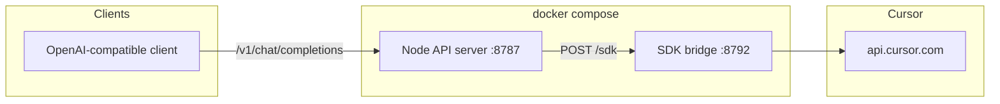

# Self-hosted Docker (Linux)

Run the OpenAI-compatible `/v1` API on Linux using **plain Node.js** and the **Cursor SDK bridge**. This path does not run Vite, Wrangler, or any Cloudflare Workers runtime in the container.

The signed **macOS app** remains the recommended end-user install. Docker is for operators who want a headless Linux host (CI runner, remote dev machine, homelab).

## Architecture



- **api** — [`docker/api-server.ts`](../docker/api-server.ts) loads the existing Worker `handleRequest` logic with a small module stub so `@cloudflare/containers` is never required at runtime. No `.dev.vars`, D1 migrations, or Cloudflare dev server.
- **bridge** — [`scripts/cursor-sdk-local-agent-bridge.mjs`](../scripts/cursor-sdk-local-agent-bridge.mjs) in [`containers/cursor-sdk-bridge/Dockerfile`](../containers/cursor-sdk-bridge/Dockerfile).

## Prerequisites

- Docker Compose v2
- A [Cursor user API key](https://cursor.com/dashboard) (Integrations)
- Outbound HTTPS to Cursor

## Quick start (two services)

From the repository root:

```bash
cp docker/env.example .env
# Optional: set CURSOR_SDK_BRIDGE_TOKEN in .env

docker compose up --build
```

Default base URL:

```txt
http://127.0.0.1:8787/v1
```

Health check:

```bash
curl -s http://127.0.0.1:8787/health
```

List models:

```bash
curl -s http://127.0.0.1:8787/v1/models \
  -H "Authorization: Bearer YOUR_CURSOR_API_KEY"
```

Chat completion:

```bash
curl -s http://127.0.0.1:8787/v1/chat/completions \
  -H "Authorization: Bearer YOUR_CURSOR_API_KEY" \
  -H "Content-Type: application/json" \
  -d '{"model":"composer-2.5","messages":[{"role":"user","content":"Say hello in one sentence."}]}'
```

Use your real Cursor API key as the Bearer token. Any non-`cmp_` token is passed through to Cursor (same as the macOS app’s direct mode).

**Models:** `composer-2.5`, `composer-2.5-fast`, and GPT-family models (`gpt-*`, `*-codex`) have the best tool-call support. Gemini, Kimi, and Grok may emit legacy text tool markers; the bridge now parses those when possible, but Composer/GPT remain the most reliable choices for agent tools in Docker.

## Configuration

| Variable | Default | Description |
|----------|---------|-------------|
| `CURSOR_API_PORT` | `8787` | Host port mapped to the API container |
| `WORKSPACE` | `.` | Host path mounted at `/workspace` in the bridge (agent working directory) |
| `CURSOR_SDK_BRIDGE_TOKEN` | empty | Optional shared secret; set the same value for `api` and `bridge` |
| `CURSOR_API_BASE` | `https://api.cursor.com` | Cursor public API base |
| `CURSOR_SDK_BRIDGE_TIMEOUT_MS` | `180000` | Bridge request timeout |
| `CURSOR_CLIENT_VERSION` | `2.6.22` | Cursor client version header |
| `CURSOR_SDK_CLIENT_VERSION` | `sdk-1.0.13` | SDK client version |

Bridge health (inside the compose network):

```txt
http://bridge:8792/health
```

## Single-container alternative

For one image (bridge + API):

```bash
docker build -f docker/Dockerfile.all-in-one -t api-for-cursor:local .
docker run --rm -p 8787:8787 \
  -v "$(pwd):/workspace" \
  api-for-cursor:local
```

## Local run without Docker

With the bridge already listening on port 8792:

```bash
export CURSOR_SDK_BRIDGE_URL=http://127.0.0.1:8792/sdk
npm run sdk:opencode-bridge   # terminal 1
npm run docker:api              # terminal 2
```

## Limitations vs macOS app

- No GUI, Keychain, Sparkle updates, or **Agent Setup** installers.
- **Client-local tools** (MCP callbacks to the host) are limited; chat-only use works out of the box with a mounted workspace.
- **Responses** multi-turn state is in-memory; container restarts clear it.
- Hosted signup / `cmp_...` proxy-key flows are not the intended Docker use case.
- Do not expose port `8787` on the public internet without TLS and access controls.

## Security

- Keep Cursor API keys in `.env` or your secrets manager, not in the image.
- Prefer `CURSOR_SDK_BRIDGE_TOKEN` when the bridge port could be reached from other containers or hosts.

## Troubleshooting

| Symptom | Likely cause |
|---------|----------------|
| `api` waits on `bridge` | Bridge not healthy; check `docker compose logs bridge` |
| `401` on `/v1/*` | Missing or invalid `Authorization: Bearer` Cursor key |
| `504` / bridge timeout | Cursor or bridge slow; raise `CURSOR_SDK_BRIDGE_TIMEOUT_MS` |
| Bridge exits with `spawn /bin/sh ENOENT` | Non-Composer models need a shell; rebuild the bridge image (`docker compose build --no-cache bridge`) or use `composer-2.5` / `composer-2.5-fast` |
| Agent cannot see project files | `WORKSPACE` volume not mounted or wrong path |
| `CURSOR_SDK_BRIDGE_URL is required` | API container started without bridge URL env |

## Related docs

- macOS releases: [production.md](production.md)
- Local development (non-Docker): [README.md](../README.md#local-development)
- Cloudflare production deploy: [README.md](../README.md#cloudflare)
